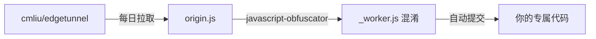

# 🔐 edgetunnel-obfuscated

> 基于 [cmliu/edgetunnel](https://github.com/cmliu/edgetunnel) 的**个人专属混淆版本**，通过 GitHub Actions 每日自动拉取最新源码并随机混淆，生成独一无二的 `_worker.js`，有效避免 Cloudflare 的 **Error 1101** 审查。

---

## 💡 原理

Cloudflare 会通过以下方式检测和封禁代理类 Worker：

- **关键词匹配**：如 `vless`、`trojan` 等协议关键词
- **代码指纹**：相同混淆模式的代码被大量部署后会被标记
- **项目特征**：特定变量名、结构模式

本仓库通过 GitHub Actions 自动执行以下流程：



每次混淆使用的随机种子不同，产出的代码独一无二，无法被 Cloudflare 指纹识别。

---

## 🚀 快速开始

### 1. Fork 本仓库 / 创建自己的仓库

点击右上角 **Fork**，或手动创建新仓库并将本仓库代码推送到你的 GitHub。

### 2. 启用 GitHub Actions

进入仓库 **Settings → Actions → General**，确保：
- Actions permissions 选择 **Allow all actions and reusable workflows**
- Workflow permissions 选择 **Read and write permissions**

### 3. 手动触发首次混淆

进入 **Actions** 标签页 → 选择 **🔐 Obfuscate edgetunnel Worker** → **Run workflow**。

稍等 1-2 分钟，仓库根目录会自动生成：
- `origin.js` — 原始未混淆代码
- `_worker.js` — 你的专属混淆代码

### 4. 部署到 Cloudflare Pages

1. 下载 `_worker.js`，将其压缩为 `worker.zip`
2. 登录 [Cloudflare Dashboard](https://dash.cloudflare.com/)
3. **Compute (Workers) → Workers 和 Pages → 创建 → Pages → 上传资产**
4. 项目名称**不要包含** `bpb`、`vless`、`proxy` 等关键词
5. 上传 `worker.zip`，点击部署

### 5. 配置环境变量

在 Pages 设置中添加变量：

| 变量名 | 必填 | 说明 |
|---|---|---|
| **ADMIN** | ✅ | 后台管理面板登录密码 |
| KEY | ❌ | 快速订阅路径密钥 |
| UUID | ❌ | 固定 UUID（UUIDv4 格式） |
| PROXYIP | ❌ | 全局反代 IP |

### 6. 绑定 KV 命名空间

1. 创建 KV 命名空间（名称不要包含 `bpb`）
2. 在 Pages **设置 → 绑定** 中添加 KV 绑定，变量名称填 **kv**
3. **重新部署**一次使绑定生效

### 7. 绑定自定义域（推荐）

Cloudflare 分配的 `.pages.dev` 域名可能被墙，建议绑定自己的域名。

---

## 📋 自动更新

工作流设置为每天自动执行（北京时间早上 6 点），你也可以随时手动触发。更新后的混淆代码会自动提交到仓库，你需要在 Cloudflare Pages 上重新部署以应用更新。

> ⚠️ **注意**：如果当前部署运行稳定，**不要轻易更新**！能用就不要动。

---

## 🔧 本地混淆（可选）

如果你想在本地测试混淆效果：

```bash
npm install -g javascript-obfuscator

javascript-obfuscator origin.js --output _worker.js \
  --compact true \
  --control-flow-flattening true \
  --control-flow-flattening-threshold 0.75 \
  --dead-code-injection true \
  --dead-code-injection-threshold 0.4 \
  --identifier-names-generator hexadecimal \
  --string-array true \
  --string-array-encoding 'rc4' \
  --string-array-threshold 0.75 \
  --transform-object-keys true \
  --unicode-escape-sequence true \
  --self-defending true \
  --split-strings true \
  --split-strings-chunk-length 5
```

---

## ⭐ 上游项目

- [cmliu/edgetunnel](https://github.com/cmliu/edgetunnel) — 原始项目，感谢作者

---

## ⚠️ 免责声明

本项目仅供教育、科研及个人安全测试之目的。使用者必须严格遵守所在地区的法律法规。作者对任何滥用行为不承担任何责任。
