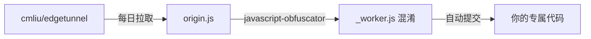

# 🔐 edgetunnel-obfuscated

> 基于 [cmliu/edgetunnel](https://github.com/cmliu/edgetunnel) 的**个人专属混淆版本**，通过 GitHub Actions 每日自动拉取最新源码并随机混淆，生成独一无二的 `_worker.js`，有效避免 Cloudflare 的 **Error 1101** 审查。

---

## 💡 原理

Cloudflare 会通过以下方式检测和封禁代理类 Worker：

- **关键词匹配**：如 `vless`、`trojan` 等协议关键词
- **代码指纹**：相同混淆模式的代码被大量部署后会被标记
- **项目特征**：特定变量名、结构模式

本仓库通过 GitHub Actions 自动执行以下流程：



每次混淆使用的随机种子不同，产出的代码独一无二，无法被 Cloudflare 指纹识别。

---

## 🚀 快速开始

### 1. Fork 本仓库 / 创建自己的仓库

点击右上角 **Fork**，或手动创建新仓库并将本仓库代码推送到你的 GitHub。

### 2. 启用 GitHub Actions

进入仓库 **Settings → Actions → General**，确保：
- Actions permissions 选择 **Allow all actions and reusable workflows**
- Workflow permissions 选择 **Read and write permissions**

### 3. 手动触发首次混淆

进入 **Actions** 标签页 → 选择 **🔐 Obfuscate edgetunnel Worker** → **Run workflow**。

稍等 1-2 分钟，仓库根目录会自动生成：
- `origin.js` — 原始未混淆代码
- `_worker.js` — 你的专属混淆代码

### 4. 部署到 Cloudflare Workers（推荐）

#### 方式 A：使用 Wrangler 命令行一键部署（最稳妥、不易出错）

1. **登录 Cloudflare**：
   ```bash
   npx wrangler login
   ```
2. **创建 KV 命名空间**：
   ```bash
   npx wrangler kv namespace create KV
   ```
   复制终端输出的 `id`，替换 [`wrangler.toml`](file:///c:/Users/Administrator/Desktop/edgetunnel-obfuscated/wrangler.toml) 中 `id = "LOCAL_KV_ID"` 这一行。
3. **设置管理员密码**：
   ```bash
   npx wrangler secret put ADMIN
   # 输入你的后台管理密码
   ```
4. **一键部署**：
   ```bash
   npx wrangler deploy
   ```

#### 方式 B：通过 Cloudflare 网页控制台部署

1. 登录 [Cloudflare Dashboard](https://dash.cloudflare.com/) → **Compute (Workers) → Workers 和 Pages → 创建 Worker**
2. 点击 **创建 Worker**（Worker 名称不要包含 `vless`、`proxy` 等关键词）并点击部署
3. 进入该 Worker 的 **设置 (Settings)**：
   * **变量与机密 (Variables and Secrets)**：添加机密 `ADMIN`，值为你的管理密码；可添加变量 `KEY`（快速订阅密钥）。
   * **绑定 (Bindings)**：添加 **KV 命名空间** 绑定，变量名称填 **`KV`**，选择你创建的 KV 命名空间。
4. 进入 Worker 的 **代码编辑器 (Quick Edit)**，清空原有代码，将本地的 `_worker.js` 全部复制粘贴进去，点击 **部署 (Deploy)**。

---

### 5. 部署到 Cloudflare Pages（备选）

1. 下载 `_worker.js`，将其压缩为 `worker.zip`（**注意：`_worker.js` 必须位于 zip 包根目录下**）
2. **Workers 和 Pages → 创建 → Pages → 上传资产**，上传 `worker.zip` 部署
3. 进入 Pages 设置：
   * **环境变量**：添加 `ADMIN`（密码）
   * **绑定**：添加 KV 绑定，变量名称填 `KV`
4. **绑定自定义域**，并在“部署”页面重新触发部署一次以生效配置。

---

### 6. 绑定自定义域与后台访问

1. **绑定自定义域名**（国内访问必备）：
   * 在 Worker / Pages 设置中的 **触发器 / 域和路由 (Domains & Routes)** 或 **自定义域** 绑定你的域名。
2. **访问管理面板**：
   * 打开浏览器访问：`https://你的域名/login` 或 `https://你的域名/admin`
   * 输入设置的 `ADMIN` 密码即可登录管理后台
   * *注意：直接访问根路径 `https://你的域名/` 会显示 Nginx 伪装页面，这是正常的防审查机制。*
3. **获取客户端订阅**：
   * 访问 `https://你的域名/<KEY>` 或在管理面板中复制各种客户端订阅链接。

---

## 📋 自动更新

工作流设置为每天自动执行（北京时间早上 6 点），你也可以随时手动触发。更新后的混淆代码会自动提交到仓库，你需要在 Cloudflare Pages 上重新部署以应用更新。

> ⚠️ **注意**：如果当前部署运行稳定，**不要轻易更新**！能用就不要动。

---

## 🔧 本地混淆（可选）

如果你想在本地测试混淆效果：

```bash
npm install -g javascript-obfuscator

javascript-obfuscator origin.js --output _worker.js \
  --compact true \
  --control-flow-flattening true \
  --control-flow-flattening-threshold 0.75 \
  --dead-code-injection true \
  --dead-code-injection-threshold 0.4 \
  --identifier-names-generator hexadecimal \
  --string-array true \
  --string-array-encoding 'rc4' \
  --string-array-threshold 0.75 \
  --transform-object-keys true \
  --unicode-escape-sequence true \
  --self-defending true \
  --split-strings true \
  --split-strings-chunk-length 5
```

---

## ⭐ 上游项目

- [cmliu/edgetunnel](https://github.com/cmliu/edgetunnel) — 原始项目，感谢作者

---

## ⚠️ 免责声明

本项目仅供教育、科研及个人安全测试之目的。使用者必须严格遵守所在地区的法律法规。作者对任何滥用行为不承担任何责任。
